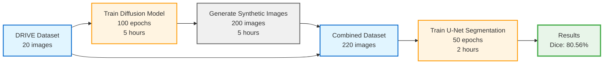
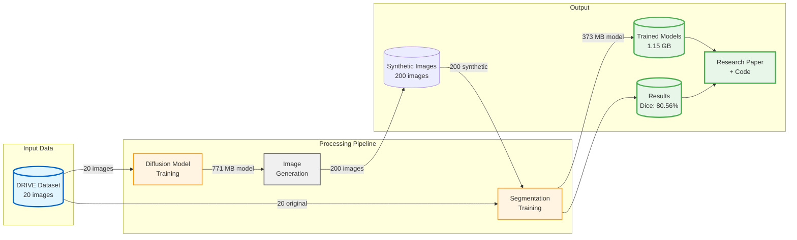

# Diffusion-Based Retinal Vessel Segmentation Pipeline - Mermaid Flowchart

## Complete Workflow Flowchart

flowchart TD
    Start([Start: DRIVE Dataset]) --> Dataset[DRIVE Dataset<br/>20 Training Images<br/>768×584 pixels]
    
    Dataset --> Preprocess[Preprocessing<br/>Resize to 512×512<br/>Normalize]
    
    Preprocess --> Split{Data Split}
    
    Split -->|All 20 images| DiffPath[Diffusion Training Path]
    Split -->|20 original images| SegPath[Segmentation Training Path]
    
    %% Diffusion Training Branch
    DiffPath --> DiffModel[Conditional DDPM<br/>64.2M Parameters<br/>U-Net Architecture]
    
    DiffModel --> DiffTrain[Train Diffusion Model<br/>100 Epochs<br/>Batch Size: 4<br/>~5 hours]
    
    DiffTrain --> DiffMetrics{Training Complete?<br/>Loss: 0.8923 → 0.1859}
    
    DiffMetrics -->|Yes| SaveDiff[Save Model<br/>771 MB checkpoint]
    DiffMetrics -->|No| DiffTrain
    
    SaveDiff --> Generate[Generate Synthetic Images<br/>200 images<br/>40 base × 5 variations]
    
    Generate --> GenProcess[Generation Process<br/>T=1000 timesteps<br/>~7.5 min/image<br/>~5 hours total]
    
    GenProcess --> SynthData[Synthetic Dataset<br/>200 augmented images<br/>+ corresponding masks]
    
    %% Combine datasets
    SynthData --> Combine[Combine Datasets]
    SegPath --> Combine
    
    Combine --> AugDataset[Augmented Dataset<br/>220 Total Images<br/>20 original + 200 synthetic]
    
    %% Segmentation Training Branch
    AugDataset --> SegSplit{Split for Training}
    
    SegSplit -->|160 images| TrainSet[Training Set<br/>20 original + 140 augmented]
    SegSplit -->|60 images| ValSet[Validation Set<br/>60 augmented]
    
    TrainSet --> SegModel[U-Net Segmentation<br/>31M Parameters<br/>Encoder-Decoder]
    ValSet --> SegModel
    
    SegModel --> SegTrain[Train Segmentation<br/>50 Epochs<br/>Batch Size: 8<br/>~2 hours]
    
    SegTrain --> SegMetrics{Validation<br/>Performance}
    
    SegMetrics -->|Best: 0.8056| SaveSeg[Save Best Model<br/>373 MB checkpoint]
    SegMetrics -->|Continue| SegTrain
    
    SaveSeg --> Results[Final Results<br/>Dice: 80.56%<br/>Train: 81.28%<br/>Val: 80.50%]
    
    Results --> Analysis[Analysis & Evaluation<br/>Minimal Overfitting<br/>0.78% gap]
    
    Analysis --> End([End: Published Results<br/>Models + Code + Paper])
    
    %% Styling
    classDef dataStyle fill:#e1f5ff,stroke:#0066cc,stroke-width:2px
    classDef modelStyle fill:#fff4e1,stroke:#ff9900,stroke-width:2px
    classDef processStyle fill:#f0f0f0,stroke:#666,stroke-width:2px
    classDef resultStyle fill:#e8f5e9,stroke:#4caf50,stroke-width:3px
    classDef decisionStyle fill:#fff3e0,stroke:#ff6f00,stroke-width:2px
    
    class Dataset,AugDataset,SynthData,TrainSet,ValSet dataStyle
    class DiffModel,SegModel modelStyle
    class Preprocess,DiffTrain,GenProcess,SegTrain,Generate processStyle
    class Results,Analysis,End resultStyle
    class Split,DiffMetrics,SegMetrics,SegSplit decisionStyle
```

## Simplified Pipeline Flowchart



## Model Architecture Flowchart

```mermaid
flowchart TD
    subgraph Diffusion["Conditional DDPM Architecture"]
        Input[Input Image 512×512×3<br/>+ Mask 512×512×1] --> Concat[Concatenate<br/>512×512×4]
        Concat --> Enc1[Encoder Block 1<br/>64 channels]
        Enc1 --> Enc2[Encoder Block 2<br/>128 channels]
        Enc2 --> Enc3[Encoder Block 3<br/>256 channels]
        Enc3 --> Enc4[Encoder Block 4<br/>512 channels]
        
        Time[Time Embedding<br/>Sinusoidal<br/>128-dim] --> TimeProj[Time Projection]
        
        Enc4 --> Bottleneck[Bottleneck<br/>+ Time Embedding<br/>+ Attention]
        TimeProj --> Bottleneck
        
        Bottleneck --> Dec4[Decoder Block 4<br/>512 channels]
        Enc4 -.Skip Connection.-> Dec4
        Dec4 --> Dec3[Decoder Block 3<br/>256 channels]
        Enc3 -.Skip Connection.-> Dec3
        Dec3 --> Dec2[Decoder Block 2<br/>128 channels]
        Enc2 -.Skip Connection.-> Dec2
        Dec2 --> Dec1[Decoder Block 1<br/>64 channels]
        Enc1 -.Skip Connection.-> Dec1
        
        Dec1 --> Output[Output<br/>Predicted Noise<br/>512×512×3]
    end
    
    subgraph Segmentation["U-Net Segmentation Architecture"]
        SegInput[RGB Image<br/>512×512×3] --> SegEnc1[Encoder<br/>64→128→256→512]
        SegEnc1 --> SegBottle[Bottleneck<br/>1024 channels]
        SegBottle --> SegDec1[Decoder<br/>512→256→128→64]
        SegEnc1 -.Skip Connections.-> SegDec1
        SegDec1 --> SegOutput[Binary Mask<br/>512×512×1]
    end
    
    style Input fill:#e1f5ff
    style Output fill:#e8f5e9
    style SegInput fill:#e1f5ff
    style SegOutput fill:#e8f5e9
    style Bottleneck fill:#fff4e1
    style SegBottle fill:#fff4e1
```



## Training Process Flowchart

```mermaid
flowchart TD
    subgraph Phase1["Phase 1: Diffusion Training"]
        P1Start[Initialize Model<br/>64.2M params] --> P1Load[Load 20 Images<br/>+ Masks]
        P1Load --> P1Epoch{Epoch Loop<br/>1 to 100}
        P1Epoch --> P1Forward[Forward Diffusion<br/>Add Noise]
        P1Forward --> P1Predict[Predict Noise<br/>ε_θ(x_t, c, t)]
        P1Predict --> P1Loss[Compute MSE Loss<br/>||ε - ε_θ||²]
        P1Loss --> P1Back[Backpropagation<br/>AdamW Optimizer]
        P1Back --> P1Update[Update Weights<br/>LR: 1e-4]
        P1Update --> P1Check{Epoch < 100?}
        P1Check -->|Yes| P1Epoch
        P1Check -->|No| P1Save[Save Model<br/>Loss: 0.1859]
    end
    
    subgraph Phase2["Phase 2: Image Generation"]
        P2Start[Load Trained Model] --> P2Select[Select Mask]
        P2Select --> P2Noise[Random Noise<br/>x_T ~ N(0,I)]
        P2Noise --> P2Loop{Timestep Loop<br/>T to 1}
        P2Loop --> P2Denoise[Denoise Step<br/>x_t-1 = μ_θ(x_t,c,t)]
        P2Denoise --> P2Continue{t > 1?}
        P2Continue -->|Yes| P2Loop
        P2Continue -->|No| P2Save[Save Image<br/>x_0]
        P2Save --> P2More{More Images?}
        P2More -->|Yes, 200 total| P2Select
        P2More -->|No| P2Done[Generation Complete]
    end
    
    subgraph Phase3["Phase 3: Segmentation Training"]
        P3Start[Initialize U-Net<br/>31M params] --> P3Load[Load 220 Images<br/>160 train, 60 val]
        P3Load --> P3Epoch{Epoch Loop<br/>1 to 50}
        P3Epoch --> P3Train[Training Batch<br/>Forward Pass]
        P3Train --> P3BCE[Compute BCE Loss<br/>with Logits]
        P3BCE --> P3Back2[Backpropagation<br/>Adam Optimizer]
        P3Back2 --> P3Val[Validation<br/>Compute Dice]
        P3Val --> P3Best{Best Dice?}
        P3Best -->|Yes| P3SaveBest[Save Best Model]
        P3Best -->|No| P3Continue
        P3SaveBest --> P3Continue{Epoch < 50?}
        P3Continue -->|Yes| P3Epoch
        P3Continue -->|No| P3Final[Final Results<br/>Dice: 80.56%]
    end
    
    Phase1 --> Phase2
    Phase2 --> Phase3
    
    style P1Save fill:#e8f5e9
    style P2Done fill:#e8f5e9
    style P3Final fill:#e8f5e9
```

## Data Flow Diagram



## Timeline Gantt Chart

```mermaid
gantt
    title Research Project Timeline
    dateFormat  HH:mm
    axisFormat %H:%M
    
    section Phase 1: Diffusion
    Model Setup           :a1, 00:00, 15m
    Training 100 Epochs   :a2, after a1, 5h
    Model Saving          :a3, after a2, 5m
    
    section Phase 2: Generation
    Load Model            :b1, after a3, 5m
    Generate 200 Images   :b2, after b1, 5h
    Save & Organize       :b3, after b2, 10m
    
    section Phase 3: Segmentation
    Model Setup           :c1, after b3, 10m
    Training 50 Epochs    :c2, after c1, 2h
    Evaluation            :c3, after c2, 10m
    
    section Phase 4: Analysis
    Results Analysis      :d1, after c3, 30m
    Paper Writing         :d2, after d1, 2h
```



## Results Metrics Diagram

```mermaid
graph TD
    subgraph Metrics["Performance Metrics"]
        DM[Diffusion Model]
        SM[Segmentation Model]
        
        DM --> DL[Loss Reduction<br/>0.8923 → 0.1859<br/>79.2% decrease]
        DM --> DT[Training Time<br/>5 hours<br/>100 epochs]
        DM --> DS[Model Size<br/>771 MB<br/>64.2M params]
        
        SM --> SD[Best Dice<br/>80.56%<br/>Epoch 43]
        SM --> ST[Training Time<br/>2 hours<br/>50 epochs]
        SM --> SS[Model Size<br/>373 MB<br/>31M params]
        SM --> SG[Generalization<br/>Train: 81.28%<br/>Val: 80.50%<br/>Gap: 0.78%]
    end
    
    style DM fill:#fff4e1,stroke:#ff9900,stroke-width:3px
    style SM fill:#fff4e1,stroke:#ff9900,stroke-width:3px
    style SD fill:#e8f5e9,stroke:#4caf50,stroke-width:2px
    style SG fill:#e8f5e9,stroke:#4caf50,stroke-width:2px


